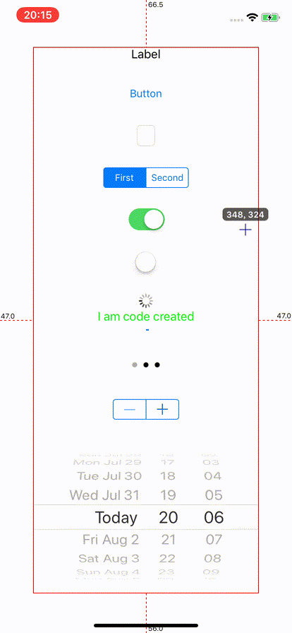

# OrzIntrospect

A Wrapper With CocoaPod of DCIntrospect

## Usage

add orzgeeker pod specs source in Podfile:

 `source 'https://github.com/OrzGeeker/Specs.git'` 

 The configure OrzIntrospect in AppDelegate as follow:

```bash
#import <OrzIntrospect/OrzIntrospect.h>

- (BOOL)application:(UIApplication *)application didFinishLaunchingWithOptions:(NSDictionary *)launchOptions {
    // Override point for customization after application launch.
    
    [OrzIntrospect defaultConfig];
    
    return YES;
}
```

After Launch your app, if your app run on simulator, you can press `space` to activate OrzIntrospect, then `?` to check the help page.

If your app run on device, you can tap screen three times with two fingers to activate OrzIntrospect, and then touch the screen, move your finger to the view you interested.




